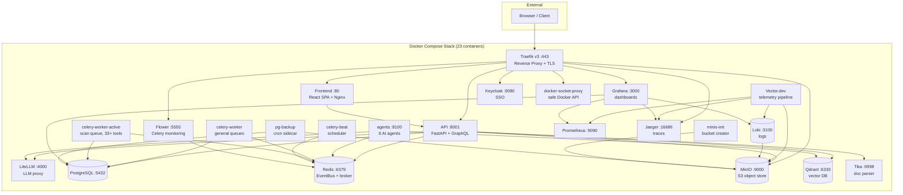

# Architecture & Services

## Architecture



## Deployment Modes

| Mode | Command | Description |
|------|---------|-------------|
| **Docker Core** | `docker compose up -d` | 5 core services (PostgreSQL, Redis, API, Worker, Frontend) |
| **Docker Full** | `docker compose --profile full up -d` | 23+ services with observability, AI, and storage |
| **Kubernetes** | `helm install sf helm/` | Horizontal scaling with Helm chart |

> **Note:** Monolith mode (`sf.py`) was removed in v6.0.0. SpiderFoot now requires the microservices stack (Docker Compose or Kubernetes).

## Docker Compose Profiles

Services are organized into **profiles** — activate only what you need:

| Profile | Services | Description |
|---------|----------|-------------|
| *(core)* | postgres, redis, api, celery-worker, frontend | Always starts — minimal working set |
| `scan` | celery-worker-active | Active recon tools (nmap, nuclei, httpx, …) |
| `proxy` | traefik, docker-socket-proxy | Reverse proxy + TLS termination |
| `storage` | minio, minio-init, qdrant, tika, pg-backup | Object storage, vector DB, document parsing |
| `monitor` | vector, loki, grafana, prometheus, jaeger | Full observability stack |
| `ai` | agents, litellm | AI analysis agents + LLM gateway |
| `scheduler` | celery-beat, flower | Periodic tasks + Celery monitoring |
| `sso` | keycloak | OIDC / SAML identity provider |
| `full` | *all of the above except SSO* | Complete deployment |

```bash
# Mix and match profiles
docker compose --profile proxy --profile storage up -d

# Full stack + SSO
docker compose --profile full --profile sso up -d
```

## Services

The Docker Compose deployment uses two networks (`sf-frontend`, `sf-backend`) and organizes services by profile.

### Core Services (always running)

| Service | Image | Port | Purpose |
|---------|-------|------|---------|
| **sf-postgres** | postgres:15-alpine | 5432 | Primary relational data store |
| **sf-redis** | redis:7-alpine | 6379 | EventBus pub/sub, caching, Celery broker |
| **sf-api** | spiderfoot-api | 8001 | FastAPI REST + GraphQL API, scan orchestration |
| **sf-celery-worker** | spiderfoot-celery-worker | — | Celery distributed task workers |
| **sf-frontend-ui** | spiderfoot-frontend | 3000 | React SPA served by Nginx |

### Profile Services

| Service | Profile | Image | Port | Purpose |
|---------|---------|-------|------|---------|
| **sf-celery-worker-active** | `scan` | spiderfoot-celery-worker-active | — | Active scanning (33+ recon tools) |
| **sf-traefik** | `proxy` | traefik:v3 | 443 | Reverse proxy, auto-TLS, routing |
| **sf-docker-proxy** | `proxy` | tecnativa/docker-socket-proxy | — | Secure Docker API access |
| **sf-minio** | `storage` | minio/minio | 9000 | S3-compatible object storage |
| **sf-minio-init** | `storage` | minio/mc | — | One-shot bucket creation |
| **sf-qdrant** | `storage` | qdrant/qdrant | 6333 | Vector similarity search |
| **sf-tika** | `storage` | apache/tika | 9998 | Document parsing (PDF, DOCX, etc.) |
| **sf-pg-backup** | `storage` | postgres:15-alpine | — | Cron sidecar: pg_dump → MinIO |
| **sf-vector** | `monitor` | timberio/vector | 8686 | Telemetry pipeline |
| **sf-loki** | `monitor` | grafana/loki | 3100 | Log aggregation |
| **sf-grafana** | `monitor` | grafana/grafana | 3000 | Dashboards & alerting |
| **sf-prometheus** | `monitor` | prom/prometheus | 9090 | Metrics collection |
| **sf-jaeger** | `monitor` | jaegertracing/jaeger | 16686 | Distributed tracing |
| **sf-agents** | `ai` | spiderfoot-agents | 8100 | 6 AI-powered analysis agents |
| **sf-litellm** | `ai` | ghcr.io/berriai/litellm | 4000 | Unified LLM proxy |
| **sf-celery-beat** | `scheduler` | spiderfoot-celery-beat | — | Periodic task scheduler |
| **sf-flower** | `scheduler` | spiderfoot-flower | 5555 | Celery monitoring dashboard |
| **sf-keycloak** | `sso` | keycloak | 9080 | OIDC / SAML identity provider |

### Docker Volumes

| Volume | Mounted By | Purpose |
|--------|-----------|---------|
| `postgres-data` | sf-postgres | Database files |
| `redis-data` | sf-redis | RDB/AOF persistence |
| `qdrant-data` | sf-qdrant | Vector index + snapshots |
| `minio-data` | sf-minio | Object storage files |
| `vector-data` | sf-vector | Buffer / checkpoints |
| `grafana-data` | sf-grafana | Dashboard state |
| `prometheus-data` | sf-prometheus | Metrics TSDB |
| `traefik-logs` | sf-traefik | Access logs |
| `mc-bin` | sf-minio-init → sf-pg-backup | Shared MinIO client binary |

### MinIO Buckets

| Bucket | Contents |
|--------|----------|
| `sf-logs` | Vector.dev log archive |
| `sf-reports` | Generated scan reports (HTML, PDF, JSON, CSV) |
| `sf-pg-backups` | PostgreSQL daily pg_dump files |
| `sf-qdrant-snapshots` | Qdrant vector DB snapshots |
| `sf-data` | General application artefacts |
| `sf-loki-data` | Loki chunk/index storage |
| `sf-loki-ruler` | Loki ruler data |

## Security Hardening

SpiderFoot v6.0.0 includes a comprehensive security hardening initiative.

### Authentication & Authorization

- **JWT authentication** on all 38+ API routers with `Depends(require_auth)`
- **WebSocket & SSE** auth validation — token verified before upgrade
- **CSP / X-Frame-Options / X-Content-Type-Options** headers via FastAPI middleware
- **SSO callback URL** origin validation (block open-redirect)
- **CORS** restricted to explicit allowed origins

### Input Validation & Injection Prevention

- **DOMPurify** sanitization on every API response rendered in the UI
- **SQL parameterization** audit across all database queries
- **Jinja2 SandboxedEnvironment** replacing native `Template`
- **SafeId** validation for all user-supplied identifiers (UUID format)
- **API error responses** scrubbed of internal stack traces and system paths

### Docker Hardening

- All Spiderfoot services run with `security_opt: [no-new-privileges:true]`
- `read_only: true` rootfs + `tmpfs` mounts for ephemeral writes (cache/logs)
- `cap_drop: [ALL]` with minimal `cap_add` where required
  (active-scanner gets `NET_RAW`/`NET_ADMIN` only)
- Docker Socket Proxy limits (`POST=0`, `NETWORKS=0`, `VOLUMES=0`)

### Frontend Security

- **AbortSignal** on all 84+ API methods (cancel on unmount)
- **XSS-safe MarkdownRenderer** with DOMPurify + `marked`
- **Code splitting** — 10/12 pages lazy-loaded (reduced initial bundle)
- **Content Security Policy** enforced at Nginx and API level
